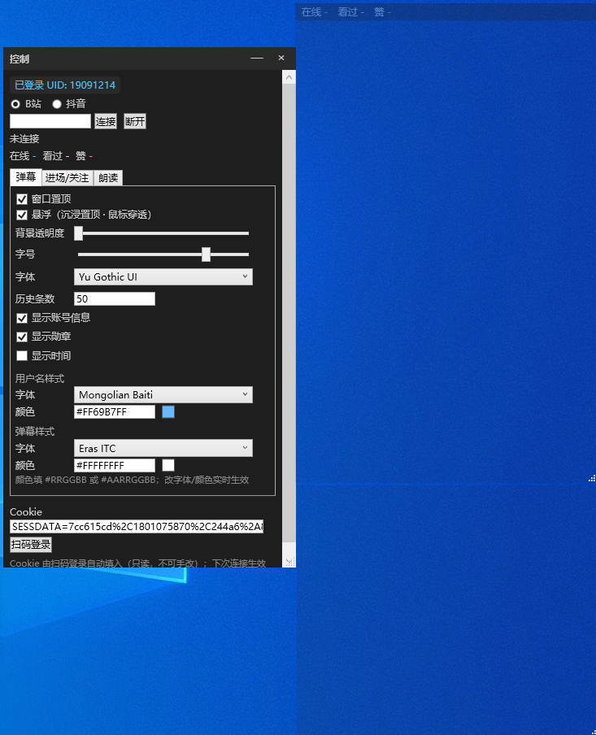

# DanmuFree


> **作者**：**Sora**　·　B站 ID：**SoraYjy**

B站 / 抖音直播间弹幕桌面客户端（Windows）。把弹幕 / 礼物 / 进场关注 / 统计展示在可悬浮、半透明的桌面窗口里；悬浮模式**真·鼠标穿透**，打游戏开着也不挡操作。协议层完全自写（零第三方直播库）。



## 功能地图

| 模块 | 说明 |
|---|---|
| **双平台** | B站（扫码登录）+ 抖音（匿名免登录），共用一套展示管道 |
| **弹幕窗** | 纯聊天弹幕列表；粉丝勋章 / 时间戳；用户名·正文分开字体颜色；千条虚拟化不卡 |
| **通知窗（独立）** | 进场 / 关注 / 礼物 / SC，四类分开关闭，金色加粗，不混进聊天流 |
| **统计** | 在线 / 看过 / 点赞 常驻顶部（B站 60s 轮询；抖音 WS 实时推送） |
| **悬浮沉浸** | 真·鼠标穿透（`WS_EX_TRANSPARENT`），全屏 / 无边框游戏不挡操作、不抢焦点 |
| **弹幕朗读** | GPT-SoVITS 音色克隆 + 系统内置双引擎；礼物连送聚合，不刷屏 |
| **持久化** | cookie / 窗口位置·大小 / 悬浮态 自动存盘，重开还原 |

> 弹幕聊天与礼物 / SC / 进场关注分两路：聊天在弹幕窗，事件在通知窗。

## 怎么用

### ① 下载即用（普通用户，推荐）

1. 到 [Releases](https://github.com/SoraYjy/DanmuFree/releases/latest) 下 **`DanmuFree-vX.Y.Z-win-x64.zip`**（~260MB，自带运行环境）
2. 解压到任意目录
3. 双击 **`DanmuFree.exe`** —— 无需装 .NET / Node

### ② 从源码（开发者）

需要 **.NET 8 SDK**；用抖音签名还需本机 **Node.js**（PATH 里有 `node`）。
```bash
dotnet run --project src/DanmuFree.App                                   # debug 运行
# 或双击构建产物：src/DanmuFree.App/bin/Debug/net8.0-windows/DanmuFree.exe
./pack.sh                                                                # 自行打包绿色版 → dist/DanmuFree/（DanmuFree.exe + sign/ + node/）
```

### 登录 & 连接

- **B站**：控制面板 →「扫码登录」用手机 app 扫码（cookie 自动存，重开免重扫）→ 输房间号（短号即可）→「连接」
- **抖音**：免登录，顶部切到「抖音」→ 输 `live.douyin.com/` 后那串房号 →「连接」（首次约 2s，签名开销）

### 日常操作

- **调样式**：弹幕显示后，控制面板调字体 / 颜色 / 透明度 / 字号（实时生效）
- **打游戏**：「弹幕」TAB 勾「**悬浮**」→ 弹幕窗置顶 + 鼠标穿透；打完取消勾选退出
- **读弹幕**：见下「弹幕朗读如何接入」

## 配置一览

控制面板分三个 TAB：

| TAB | 可配置项 |
|---|---|
| **弹幕** | 置顶 · 背景透明度 · 字号 · 字体 · 历史条数 · 显示账号/勋章/时间 · 用户名/弹幕字体颜色 · **弹幕窗悬浮** |
| **进场/关注** | 接收进场 · 接收关注 · 显示通知窗 · 字号/字体/透明度 · **通知窗悬浮** |
| **朗读** | 开关 · 引擎(GPT-SoVITS/系统) · 系统音色 · 读哪些(弹幕·SC·礼物·用户名) · 语速 · 语气(采样温度) · 音量 · 屏蔽词 · 测试 |

配置 / 日志在 `%AppData%\DanmuFree\`（`settings.json`、`log.txt`）。

## 弹幕朗读如何接入

朗读读 **聊天 / SC / 礼物**，不读进场关注；朗读开关独立于显示（可"看着不读" / "不显示但读"）。

**最快（零配置）**：朗读 TAB → 选 **「系统内置」** → 勾「启用」→「测试朗读」。用 Windows 自带中文语音（Huihui），免参考音频。

**要更逼真音色（GPT-SoVITS）**

GPT-SoVITS 是**独立的第三方音色克隆服务**，不在本项目内——部署、环境、模型、API 启动方式见其仓库：<https://github.com/RVC-Boss/GPT-SoVITS>（默认端口 9880）。

API 起好后，在 DanmuFree「朗读」TAB 选 **GPT-SoVITS**，填 **服务地址 + 3~10 秒参考音频 + 参考文本（音频里说的字）+ 语言** 即可。

> 📊 **本机部署开销（实测）**：常驻内存约 **3.5 GB**；GPU 推理**官方主推 N 卡（CUDA）、开箱即用**（A 卡仅 Linux 下 ROCm 实验性、Windows 基本跑不通；Mac 走 MPS）；CPU 空闲时几乎不占、仅合成语音时瞬时拉高。无独显也能纯 CPU 跑（慢、更吃内存）。

**可选**：念用户名开关（开=「xx 说，…」，关=只读正文；礼物恒带用户名不受影响）· 语气滑块（采样温度，高丰富低平稳）· 礼物连送在 1200ms 内合并成「xx 送了 N 个 yy」。

## 致谢

- 抖音签名 `sign/sign.js` 是 webmssdk 的反混淆产物，跟随 [saermart/DouyinLiveWebFetcher](https://github.com/saermart/DouyinLiveWebFetcher) 维护。
- 朗读：[GPT-SoVITS](https://github.com/RVC-Boss/GPT-SoVITS)、Windows SAPI / [System.Speech](https://learn.microsoft.com/dotnet/api/system.speech)；播放 [NAudio](https://github.com/naudio/NAudio)。
- [CommunityToolkit.Mvvm](https://github.com/CommunityToolkit/dotnet)、[QRCoder](https://github.com/codebude/QRCoder)、Microsoft .NET / WPF。

## 协议

[**MIT**](LICENSE)，随便用、随便改。

> ⚠️ `sign/sign.js` 版权归字节跳动，属第三方反混淆产物；使用须遵循抖音服务条款，本项目仅作技术学习与个人自用。B站 / 抖音名称、Logo 及接口归各自平台所有。

---

> 📌 开发细节 / 协议实现 / 已知限制 / 路线图见 [CLAUDE.md](CLAUDE.md)。
